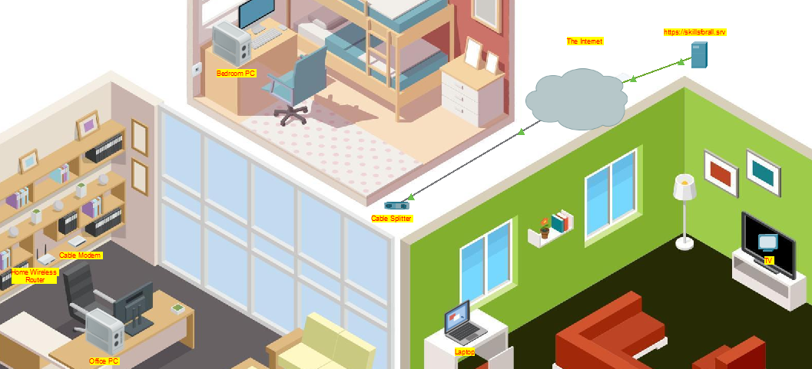

# Dokumentation LB3 Modul 129

## CISCO Networking Academy Networking Basics
### Module 4
Das Modul 4 der Networking Basics, befasst sich mit dem Aufbau eines Heimnetzwerkes.
zuerst erfährt man wie ein Router aufgebaut ist, und wie man Ihn einrichtet.

**Packet Tracer aufgabe 1:**
In dieser Aufgabe geht es Haptsächlich um das Einrichten eines Heim-Routers.
