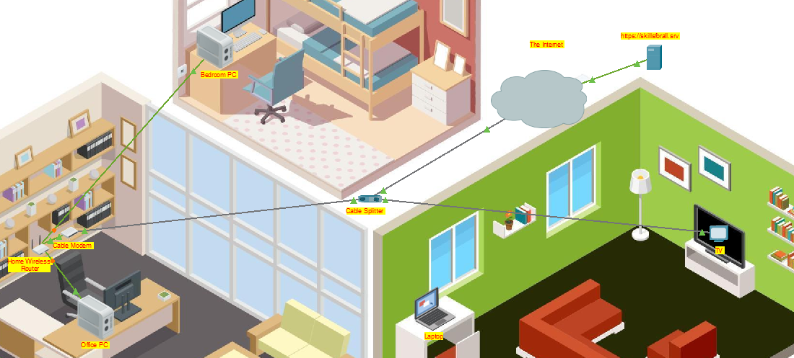
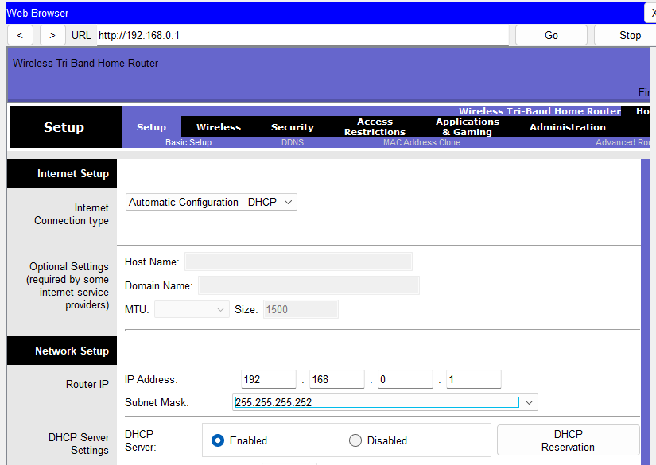
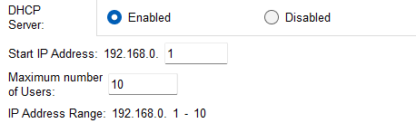
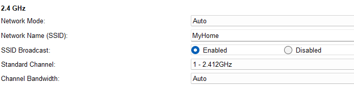
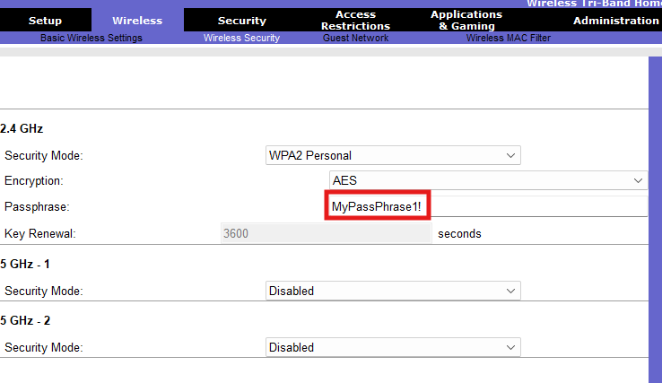
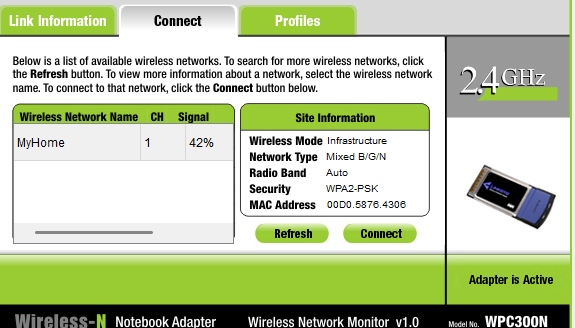
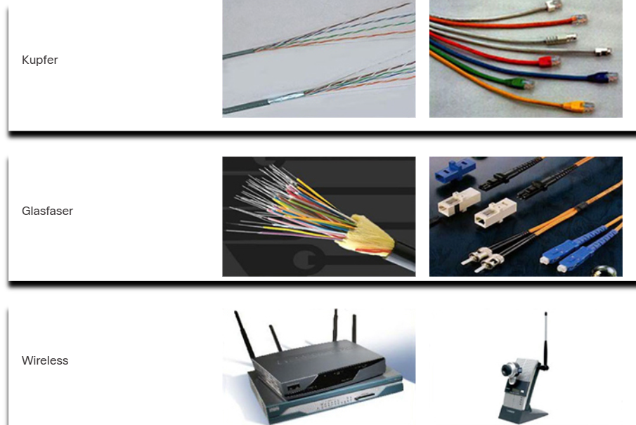
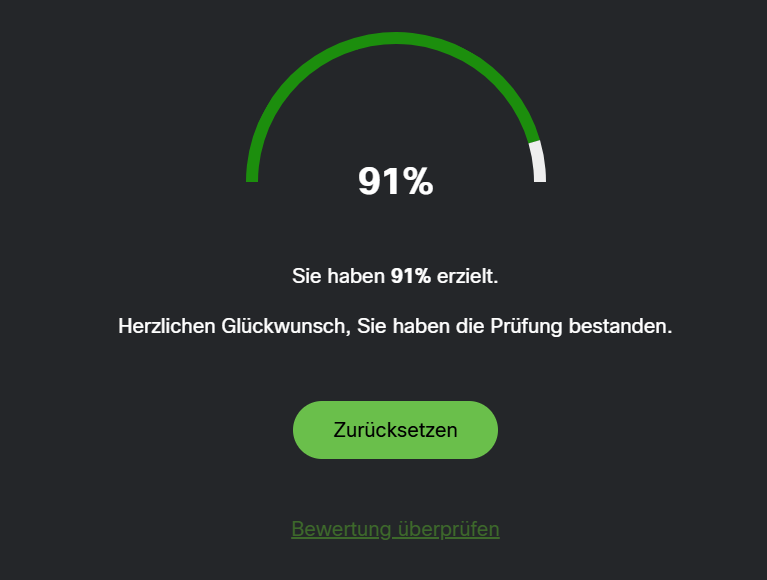
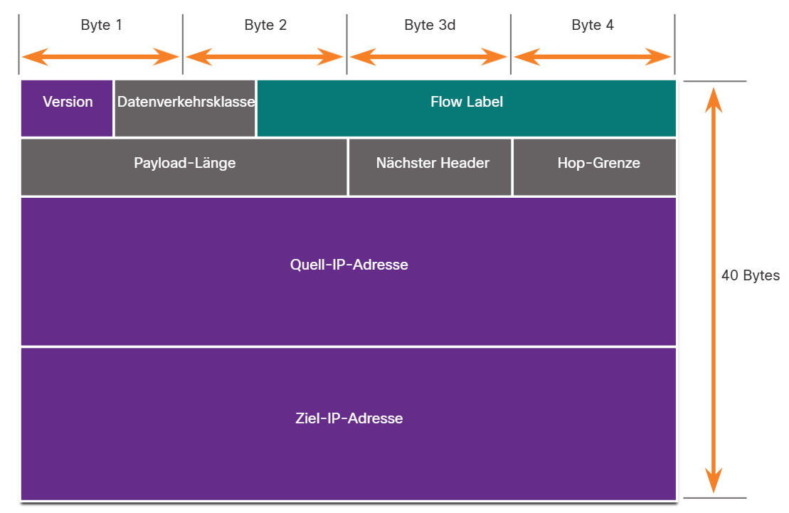

# Dokumentation LB3 Modul 129

## CISCO Networking Academy Networking Basics
### Module 4
Das Modul 4 der Networking Basics, befasst sich mit dem Aufbau eines Heimnetzwerkes.
zuerst erfährt man wie ein Router aufgebaut ist, und wie man Ihn einrichtet.

**Packet Tracer aufgabe 1:**
In dieser Aufgabe geht es Haptsächlich um das Einrichten eines Heim-Routers. 
Dies ist die Ausgangssituation.

1. Ich musste den Cable Splitter per Koaxialkabel mit dem Cable modem und dem TV verbinden.
2. Anschliessend musste ich den Cable splitter mit dem Wireless Router verbinden und die beiden PCs (officePC und bedroom PC) mit dem Wireless Router. 

3. Hier war das einrichten des Routers an der Reihe, und ich musste per Office PC über den Webbrowser auf den Router zugreiffen. 

4. Das erste das verlangt wurde war, die maximalen Hosts für DHCP von 50 auf 10 anzupassen. 

5. der Nächste schritt war das Standart Passwort von admin zu MyPasswort1! zu ändern.
6. das Wireless LAN konfigurieren. 

7. Wireless Security Konfigurieren 

8. Konnektivität testen 

9. Ende 

(Ich habe Keine Ahnung wieso das Passwort als nicht abgeschlossen angezeigt wird. Ich habe es gesetzt.)

### Modul 5
In diesem Modul ging es um die Grundlage der Kummunikation.
Es wurden Protokolle und Standarts besprochen, und anschliessend in einer kleinen Prüfung abgefragt.
Die Wichtigsten punkte waren, das ISO/OSI Modell und die besprochenen Schichten.

### Modul 6
Hier wurden Netzwerkmedien Besprochen.
Das Erste Video besprach Basics wie Unshieldet Twistet Pair Kabel und RJ45 konnektoren, sowie Koaxial Kabel.  
Die Zweite art von Netzwerkmedien die besprochen wurde waren Glasfaserkabel und es wurde über die vorteile gegenüber kupferkabel gesprochen. 
 
**Hauptkriterien bei der Auswahl von Netzwerkmedien**

- Maximale Übertragungsdistanz  
- Geeignete Installationsumgebung  
- Übertragbare Datenmenge und Geschwindigkeit  
- Kosten für Medium und Installation

Auch hier gab es eine Kurze prüfung mit 11 Fragen 

### Modul 7
In Modul 7 geht es um die Zugriffsschicht.
Es wurde Gezeigt wie ein Ethernet Frame aufgebaut sein soll und was die verschiedenen einträge bewirken.

Es gab vereinzelte Fragen die den wissenstand prüften.
