# Dokumentation LB3 Modul 129

## CISCO Networking Academy Networking Basics
### Modul 4
Das Modul 4 der Networking Basics, befasst sich mit dem Aufbau eines Heimnetzwerkes.
zuerst erfährt man wie ein Router aufgebaut ist, und wie man Ihn einrichtet.

**Packet Tracer aufgabe 1:**
In dieser Aufgabe geht es Haptsächlich um das Einrichten eines Heim-Routers. 
Dies ist die Ausgangssituation.

1. Ich musste den Cable Splitter per Koaxialkabel mit dem Cable modem und dem TV verbinden.
2. Anschliessend musste ich den Cable splitter mit dem Wireless Router verbinden und die beiden PCs (officePC und bedroom PC) mit dem Wireless Router. 

3. Hier war das einrichten des Routers an der Reihe, und ich musste per Office PC über den Webbrowser auf den Router zugreiffen. 

4. Das erste das verlangt wurde war, die maximalen Hosts für DHCP von 50 auf 10 anzupassen. 

5. der Nächste schritt war das Standart Passwort von admin zu MyPasswort1! zu ändern.
6. das Wireless LAN konfigurieren. 

7. Wireless Security Konfigurieren 

8. Konnektivität testen 

9. Ende 

(Ich habe Keine Ahnung wieso das Passwort als nicht abgeschlossen angezeigt wird. Ich habe es gesetzt.)

### Modul 5
In diesem Modul ging es um die Grundlage der Kummunikation.
Es wurden Protokolle und Standarts besprochen, und anschliessend in einer kleinen Prüfung abgefragt.
Die Wichtigsten punkte waren, das ISO/OSI Modell und die besprochenen Schichten.

### Modul 6
Hier wurden Netzwerkmedien Besprochen.
Das Erste Video besprach Basics wie Unshieldet Twistet Pair Kabel und RJ45 konnektoren, sowie Koaxial Kabel.  
Die Zweite art von Netzwerkmedien die besprochen wurde waren Glasfaserkabel und es wurde über die vorteile gegenüber kupferkabel gesprochen. 
 
**Hauptkriterien bei der Auswahl von Netzwerkmedien**

- Maximale Übertragungsdistanz  
- Geeignete Installationsumgebung  
- Übertragbare Datenmenge und Geschwindigkeit  
- Kosten für Medium und Installation

Auch hier gab es eine Kurze prüfung mit 11 Fragen 

### Modul 7
In Modul 7 geht es um die Zugriffsschicht.
Es wurde Gezeigt wie ein Ethernet Frame aufgebaut sein soll und was die verschiedenen einträge bewirken.

Es gab vereinzelte Fragen die den wissenstand prüften und zum abschluss eine kleine Prüfung.
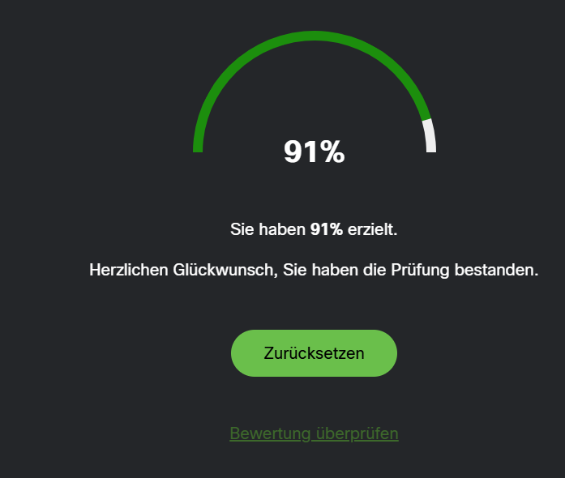

### Zwischenprüfung
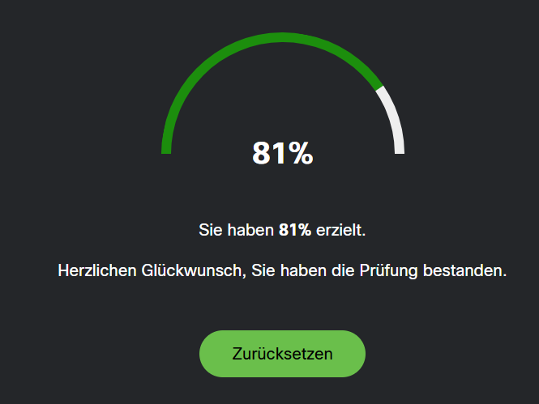
### Modul 8

Dieses Modul behandelt das Internetprotokoll (IPv4)
dazu gibt es eine kurze Packettracer übung.
1. Ausgangslage 
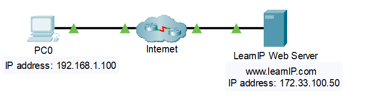
2. pingen des Webservers 

3. Webserver kontaktieren 
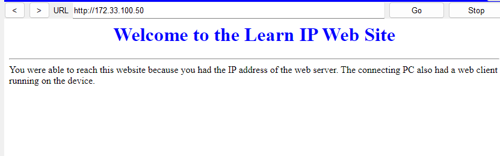
4. Fertig
Nach der übung gab es noch ein Video und einen Text zum Thema Internetprotokoll und vertievte das wissen etwas.
wie nach jedem modul gab es auch hier eine prüfung.
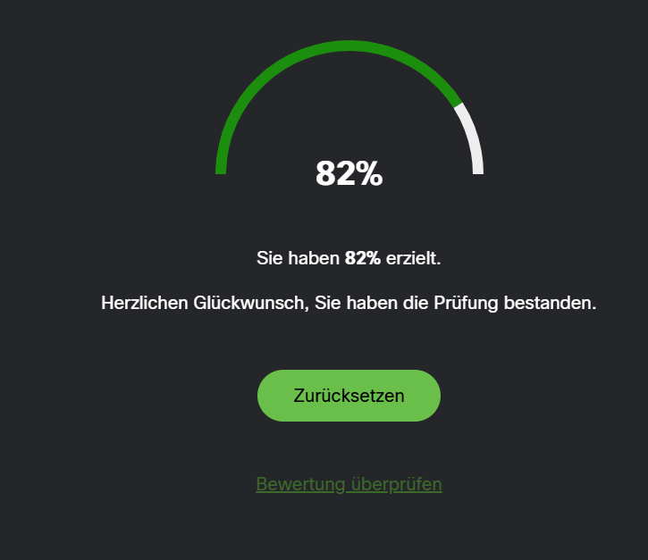

### Modul 9
In diesem Modul gieng es um Unicast Broadcast und Multicast.
Nach einigen demonstrationen und videos gab es eine übung bei der man die gesuchte Zieladresse finden musste.
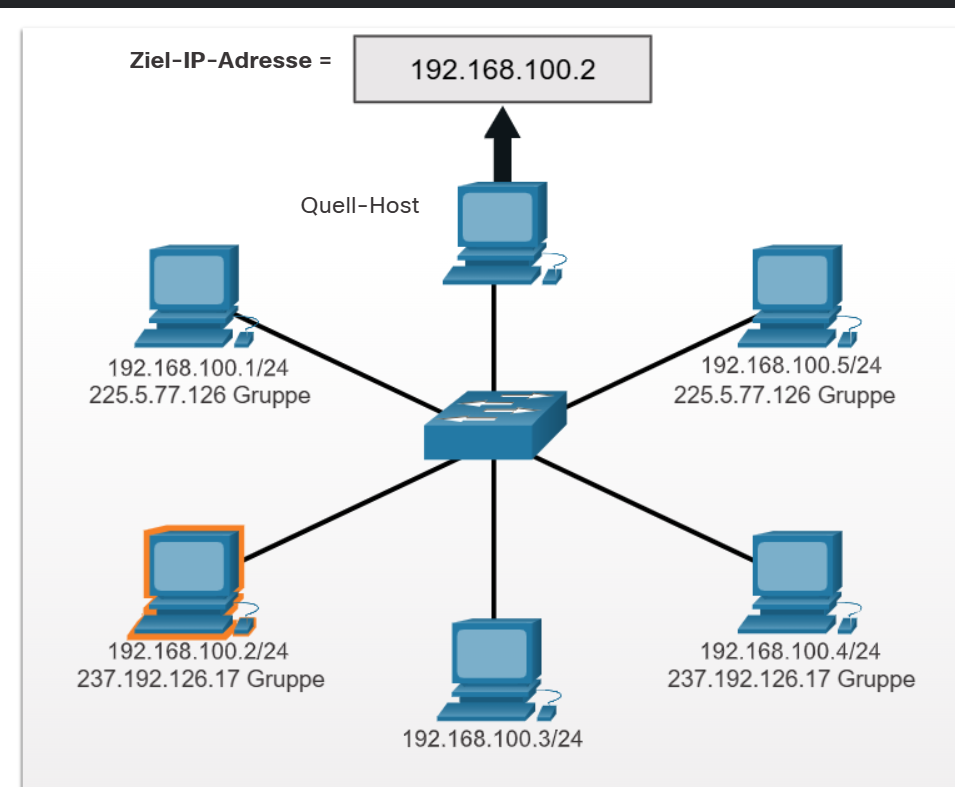
**Unicast**
Datenübertragung von einem Sender an genau einen bestimmten Empfänger.

**Multicast**
Datenübertragung von einem Sender an eine definierte Empfängergruppe.

**Broadcast**
Datenübertragung von einem Sender an alle Geräte innerhalb einer Broadcast-Domain.

Weiterführend ging es um die Arten von IPv4 Adressen,
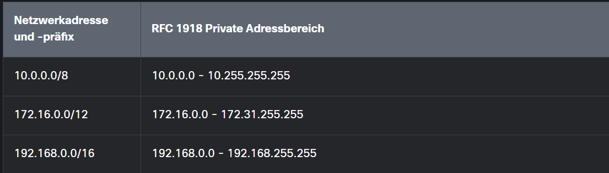
und über Netzwerksegmentierung.
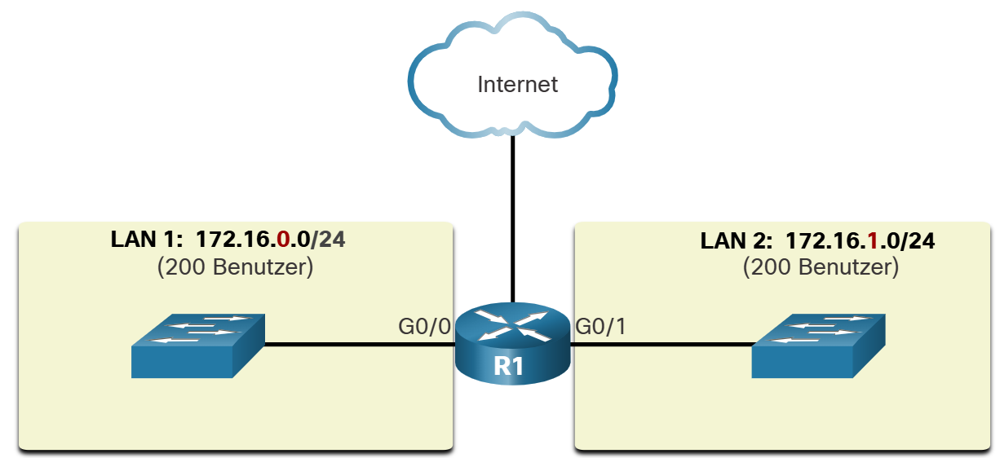

Zum schluss noch die Prüfung. 
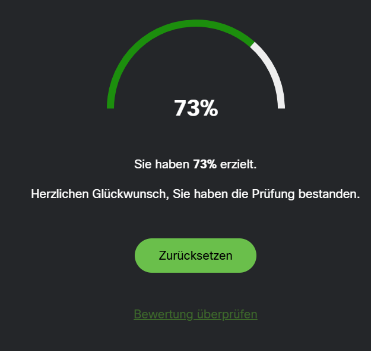 
(aufgrund der länge dieses Moduls und dem fehlen spannender aufgaben habe ich nur die wichtigsten teile dokumentiert)

### Modul 10
Hier wird IPv6 angesprochen.
 
als erstes wurde die notwendichkeit von IPv6 angesprochen.
Es wurden dinge wie zum Beispiel der verknappung von IPv4 adressen erwähnt. 
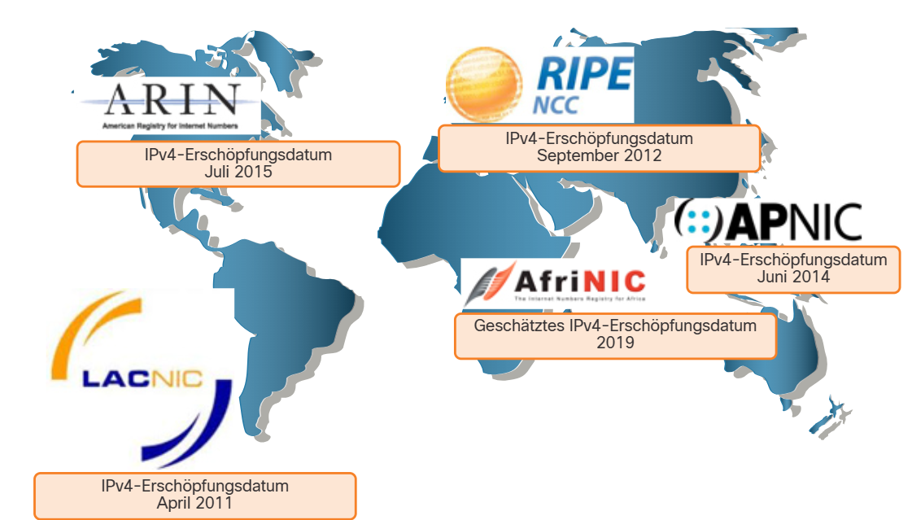 
Das Modul ging auch auf das hexadezimalsystem ein und erklärte dieses in zusammenhang mit IPv6. 
 
Es gab eine kurze aktivität zur darstellung von IPv6 
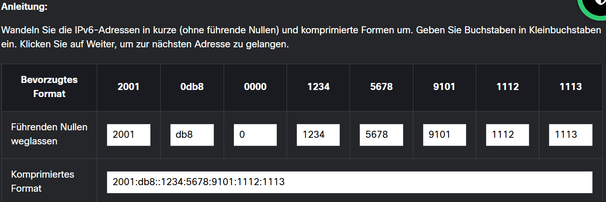 

Und zum abschluss noch eine Prüfung. 
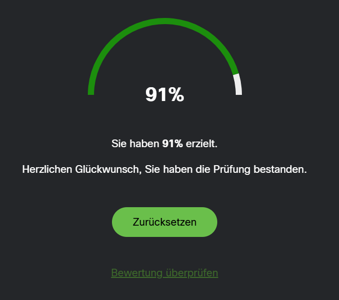

### Modul 11
Hier geht es um DHCP.
Es gibt eine kleine Packettracer aufgabe.
1. Ausgangslage 
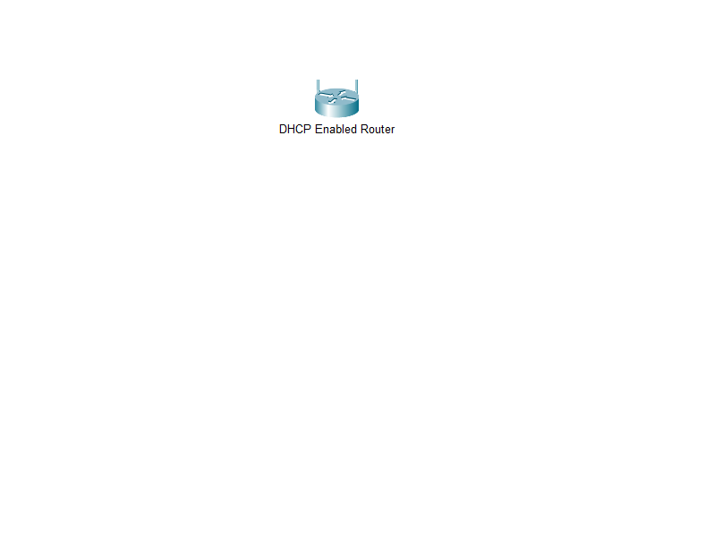 
2. PCs verbinden 
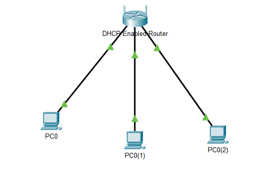 
3. DHCP aktivieren 
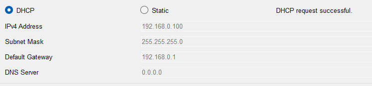
4. Router webpage öffnen 
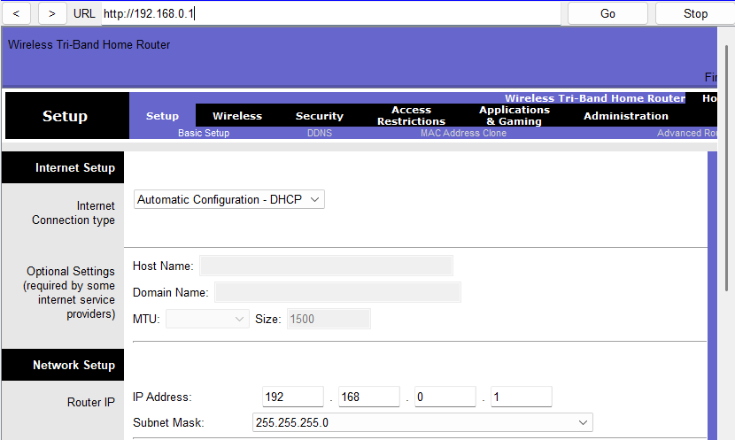
5. DHCP kontrolieren 
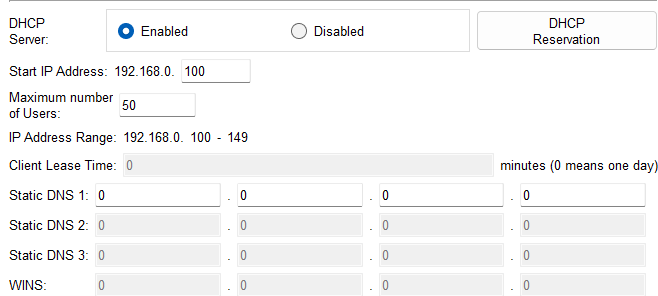
6. Router IP ändern 
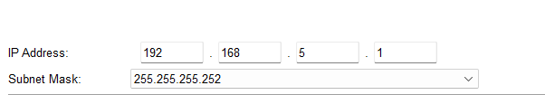
7. IP des PCs erneuern 
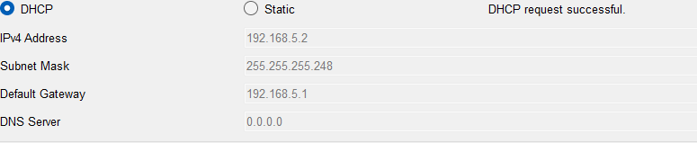
8. Neue webpage öffnen 
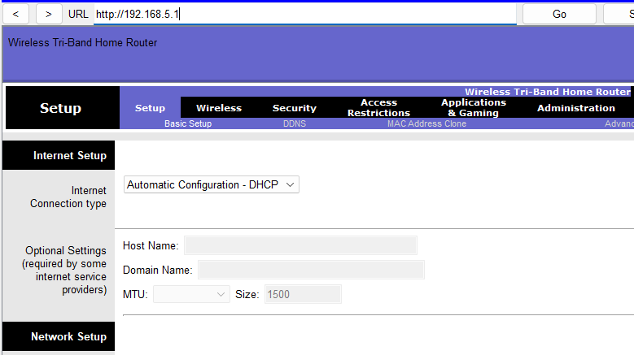
9. Start IP anpassen 
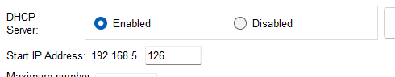
10. Maximale user anpassen 
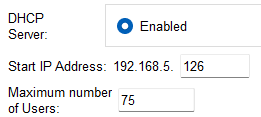
11. PC IP erneuern 
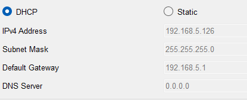
12. Per ipconfig testen 
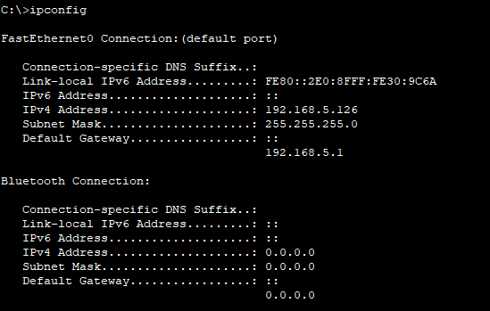
13. PC2 ping test zu Router 
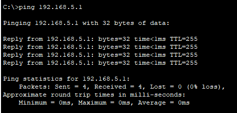
14. Ping test PC02 zu PC0 
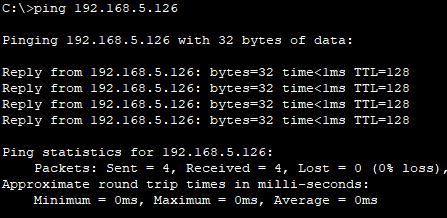
15. PC2 ping test PC1 
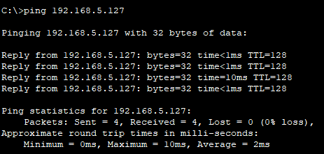
16. fertig 
Wie Immer noch eine Abschlussprüfung.
 

### Zwischenprüfung
Bevor Modul 12 begann, kahm noch eine Zwischenprüfung. 
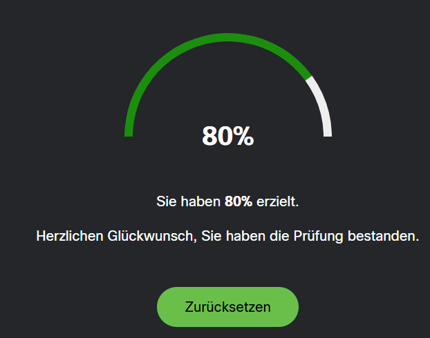

### Modul 12
Dieses Modul behandelt Gateways zu anderen Netzwerken.
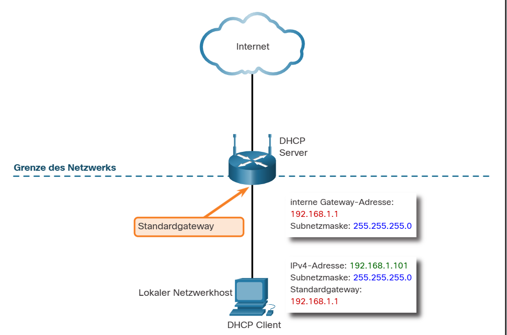

Es gab eine kurze Packettracer aufgabe.
1. Ausgangslage 
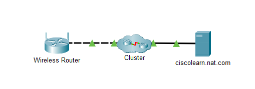
2. PC hinzufügen und DHCP aktivieren. 
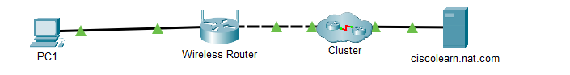
3. per WEB browser auf Standart Gateway zugreifen. 
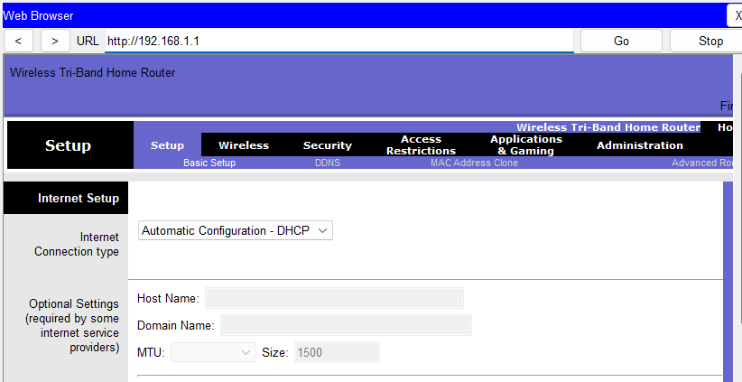
4. ISP adresse 
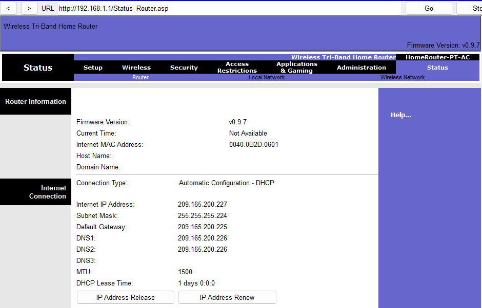
5. Drei weitere PCs hinzufügen. 
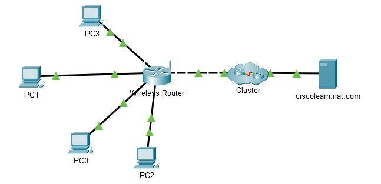
6. IP der Neuen Geräte mit Ipconfig /all überprüfen. 
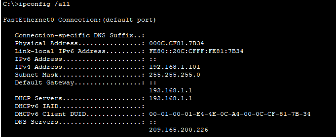
7. NAT mit dem Simulationsmodus ansehen. 
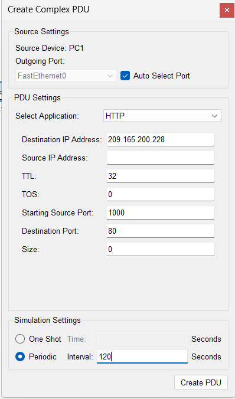
8. Simulation 
<video controls src="Screenshots/M12_simvid.mp4" title="Simulation"></video>

9. 