# Dokumentation LB3 Modul 129

## CISCO Networking Academy Networking Basics
### Modul 4
Das Modul 4 der Networking Basics, befasst sich mit dem Aufbau eines Heimnetzwerkes.
zuerst erfährt man wie ein Router aufgebaut ist, und wie man Ihn einrichtet.

**Packet Tracer aufgabe 1:**<br>
In dieser Aufgabe geht es Haptsächlich um das Einrichten eines Heim-Routers.<br>
Dies ist die Ausgangssituation.<br>

1. Ich musste den Cable Splitter per Koaxialkabel mit dem Cable modem und dem TV verbinden.<br>
2. Anschliessend musste ich den Cable splitter mit dem Wireless Router verbinden und die beiden PCs (officePC und bedroom PC) mit dem Wireless Router.<br>

3. Hier war das einrichten des Routers an der Reihe, und ich musste per Office PC über den Webbrowser auf den Router zugreiffen.<br>

4. Das erste das verlangt wurde war, die maximalen Hosts für DHCP von 50 auf 10 anzupassen.<br>

5. der Nächste schritt war das Standart Passwort von admin zu MyPasswort1! zu ändern.<br>
6. das Wireless LAN konfigurieren.<br>

7. Wireless Security Konfigurieren<br>

8. Konnektivität testen<br>

9. Ende<br>
<br>
(Ich habe Keine Ahnung wieso das Passwort als nicht abgeschlossen angezeigt wird. Ich habe es gesetzt.)

### Modul 5
In diesem Modul ging es um die Grundlage der Kummunikation.
Es wurden Protokolle und Standarts besprochen, und anschliessend in einer kleinen Prüfung abgefragt.
Die Wichtigsten punkte waren, das ISO/OSI Modell und die besprochenen Schichten.

### Modul 6
Hier wurden Netzwerkmedien Besprochen.
Das Erste Video besprach Basics wie Unshieldet Twistet Pair Kabel und RJ45 konnektoren, sowie Koaxial Kabel.  
Die Zweite art von Netzwerkmedien die besprochen wurde waren Glasfaserkabel und es wurde über die vorteile gegenüber kupferkabel gesprochen.<br>
<br>
**Hauptkriterien bei der Auswahl von Netzwerkmedien**

- Maximale Übertragungsdistanz  
- Geeignete Installationsumgebung  
- Übertragbare Datenmenge und Geschwindigkeit  
- Kosten für Medium und Installation

Auch hier gab es eine Kurze prüfung mit 11 Fragen<br>


### Modul 7
In Modul 7 geht es um die Zugriffsschicht.
Es wurde Gezeigt wie ein Ethernet Frame aufgebaut sein soll und was die verschiedenen einträge bewirken.

Es gab vereinzelte Fragen die den wissenstand prüften und zum abschluss eine kleine Prüfung.


### 1. Zwischenprüfung

### Modul 8

Dieses Modul behandelt das Internetprotokoll (IPv4)
dazu gibt es eine kurze Packettracer übung.
1. Ausgangslage<br>

2. pingen des Webservers<br>

3. Webserver kontaktieren<br>

4. Fertig<br>
Nach der übung gab es noch ein Video und einen Text zum Thema Internetprotokoll und vertievte das wissen etwas.
wie nach jedem modul gab es auch hier eine prüfung.


### Modul 9
In diesem Modul gieng es um Unicast Broadcast und Multicast.
Nach einigen demonstrationen und videos gab es eine übung bei der man die gesuchte Zieladresse finden musste.

**Unicast**
Datenübertragung von einem Sender an genau einen bestimmten Empfänger.

**Multicast**
Datenübertragung von einem Sender an eine definierte Empfängergruppe.

**Broadcast**
Datenübertragung von einem Sender an alle Geräte innerhalb einer Broadcast-Domain.

Weiterführend ging es um die Arten von IPv4 Adressen,

und über Netzwerksegmentierung.


Zum schluss noch die Prüfung.<br>
<br>
(aufgrund der länge dieses Moduls und dem fehlen spannender aufgaben habe ich nur die wichtigsten teile dokumentiert)

### Modul 10
Hier wird IPv6 angesprochen.
<br>
als erstes wurde die notwendichkeit von IPv6 angesprochen.
Es wurden dinge wie zum Beispiel der verknappung von IPv4 adressen erwähnt.<br>
<br>
Das Modul ging auch auf das hexadezimalsystem ein und erklärte dieses in zusammenhang mit IPv6.<br>
<br>
Es gab eine kurze aktivität zur darstellung von IPv6<br>
<br>

Und zum abschluss noch eine Prüfung.<br>


### Modul 11
Hier geht es um DHCP.
Es gibt eine kleine Packettracer aufgabe.
1. Ausgangslage<br>
<br>
2. PCs verbinden<br>
<br>
3. DHCP aktivieren<br>

4. Router webpage öffnen<br>

5. DHCP kontrolieren<br>

6. Router IP ändern<br>

7. IP des PCs erneuern<br>

8. Neue webpage öffnen<br>

9. Start IP anpassen<br>

10. Maximale user anpassen<br>

11. PC IP erneuern<br>

12. Per ipconfig testen<br>

13. PC2 ping test zu Router<br>

14. Ping test PC02 zu PC0<br>

15. PC2 ping test PC1<br>

16. fertig<br>
Wie Immer noch eine Abschlussprüfung.
<br>

### 2. Zwischenprüfung
Bevor Modul 12 begann, kahm noch eine Zwischenprüfung.<br>


### Modul 12
Dieses Modul behandelt Gateways zu anderen Netzwerken.
Es wurde der Standartgateway und NAT erklärt.


Es gab eine kurze Packettracer aufgabe.
1. Ausgangslage<br>

2. PC hinzufügen und DHCP aktivieren.<br>

3. per WEB browser auf Standart Gateway zugreifen.<br>

4. ISP adresse<br>

5. Drei weitere PCs hinzufügen.<br>

6. IP der Neuen Geräte mit Ipconfig /all überprüfen.<br>

7. NAT mit dem Simulationsmodus ansehen.<br>

8. Simulation<br>
[Video herunterladen](Screenshots/M12_simvid.mp4)
9. Fertig<br>

Und wie jedesmal eine kurze abschlussprüfung.


### Modul 13
Modul 13 behandelt die Adressenauflösung.
Es gibt eine Cisco Packet Tracer aufgabe bei der Informationen in einem netz gesammelt werden müssen.

1. Ping nachverfolgen<br>
2. MAC adresse im Packet finden.<br>
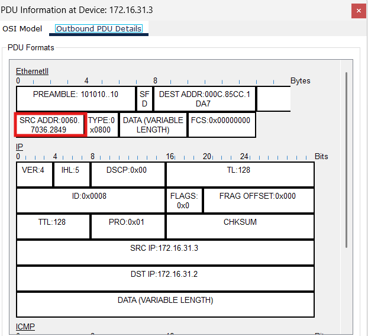
3. Mit diesem vorgehen die gegebene tabellen ausfüllen.<br>
Ping 172.16.31.3 --> 172.16.31.2<br>
<br>
Ping 172.16.31.3 --> 10.10.10.2<br>
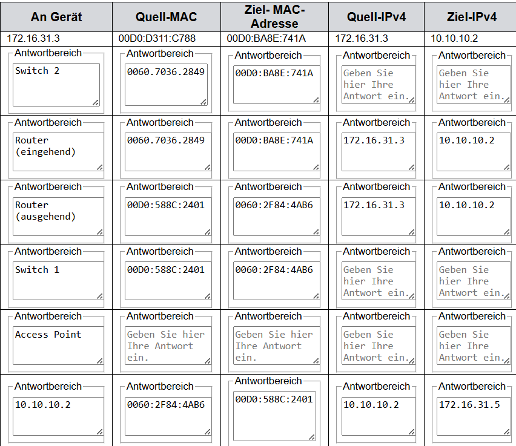<br>
Ping 10.10.10.2 --> 172.16.31.3

Die Aufgabe gab einen tieferen einblick in Pakete (in den aufgaben PDU genannt).
Sie war etwas repetitiev aber gut für die veranschaulichung.

Der nächsten Teil behandelte Broadcast domains und die vor sowie nachteile ebendessen.
Das Bereitgestellte Bild half bei der eher Logischen Thematik.<br>
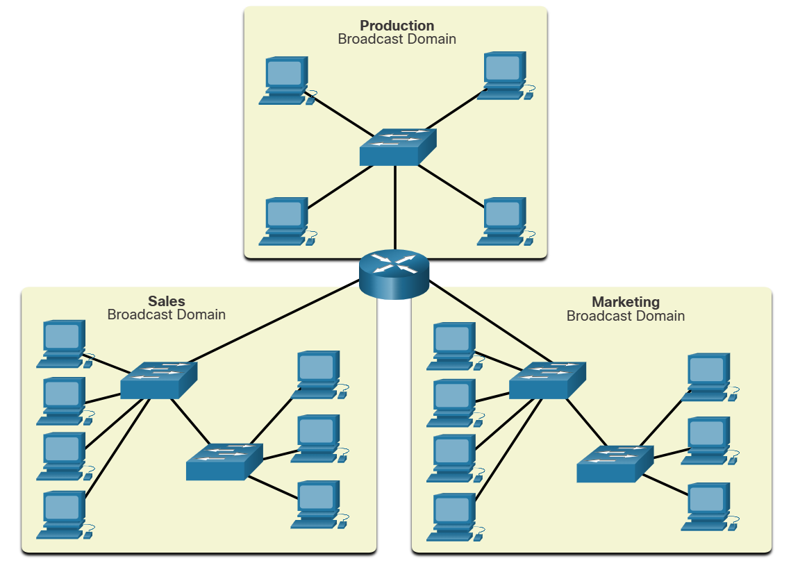


Anschliessend ging es noch um ARP und es wurde in einem Video erklärt wie ARP funktioniert.
Eine kleine Demonstration zeigte den ARP prozess noch verbildlicht, was half alles zu verstehen.

Die Bestandene abschlussprüfung von Modul 13.


### Modul 14
Dieses Modul behandelt Routing zwischen netzwerken.
Im Groben ging es um:
- Die Notwendigkeit des Routing
- Die Routing tabelle
- Lan einrichtung

Zu der Notendichkeit des Routing wurden einige Vorteile augezählt eir z.B. Die verkleinerung von Broadcast domänen.

**Aufgabe:**Datenverkehr in einem gerouteten Netzwerk beobachten<br>
1. die Ausgangslage.<br>
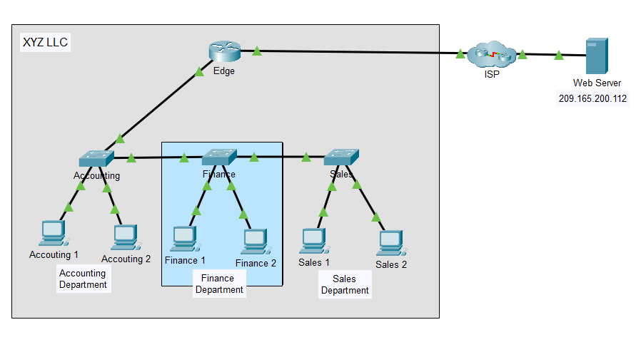
2. Ping test<br>
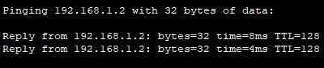
3. Netz neu verkabeln<br>
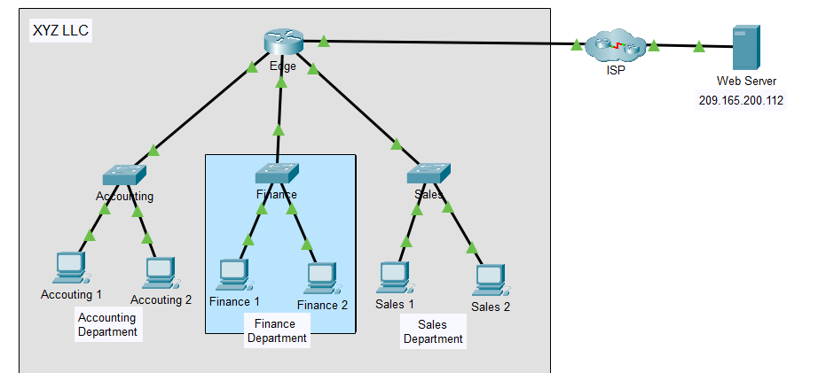
4. Ping test Sales 1 --> Sales 2<br>
[helpsaveme](M14_p2.md)
5. Pingtest Acounting 1--> Acounting 2<br>
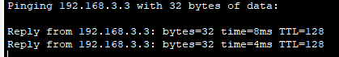
6. Fertig<br>
**Aufgabe:** Ein LAN einrichten<br>
1. Ausgangslage<br>
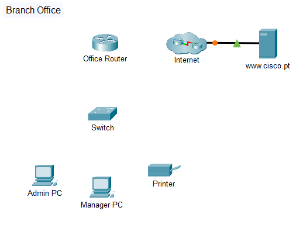
2. Verkabelung nach Tabelle.<br>
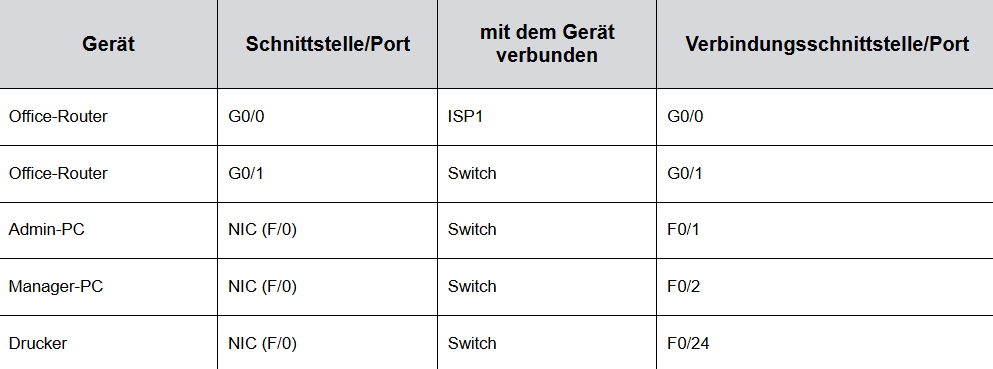
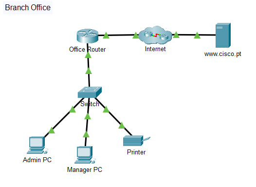
3. IP per DHCP holen.<br>
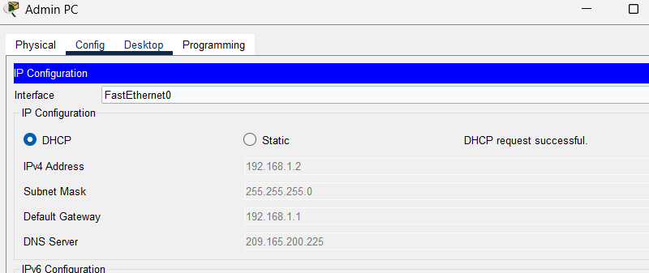
4. Drucker IP festlegen.<br>
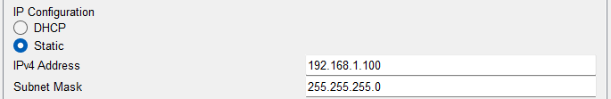
5. Konnektivitätstest Admin PC --> Drucker<br>
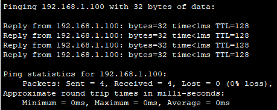
6. Test Admin PC --> Internet<br>
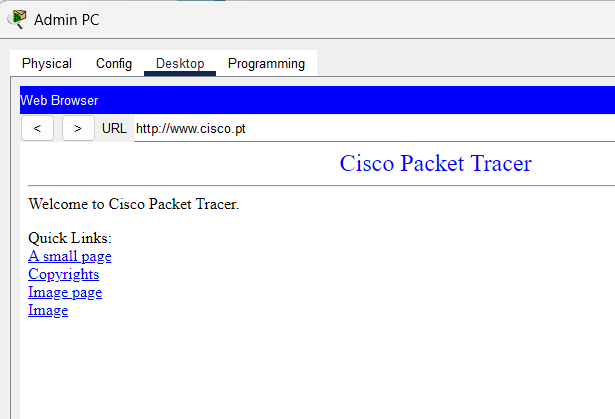
7. Fertig<br>

Zum schluss noch eine Abschlussprüfung.
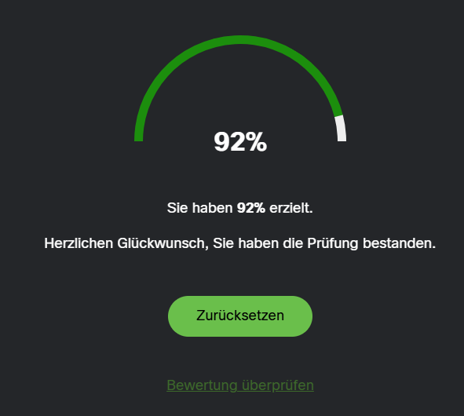

### 3. Zwischenprüfung
Die Zwischenprüfung zu Kommunikation zwischen netzwerken.
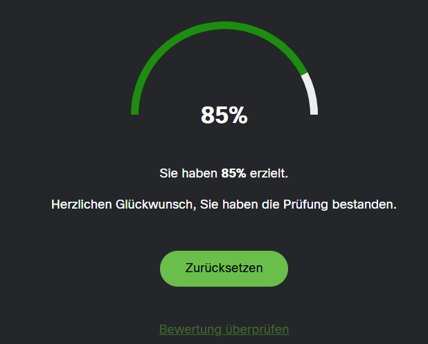

### Modul 15
Dieses Modul handelt um die Transportschicht.
Besprochen wurden TCP/UDP und Port nummern

TCP/UDP:<br>
Dieser Teil ist sehr kurz und erklärt in eine Acht minütigen Video das Konzept von TCP und UDP.

Port nummern:<br>
Dieses thema wird etwas länger behandelt.<br>
Die folgenden Bilder veranschaulichen das thema in verbindung mit TCP und UDP.<br>
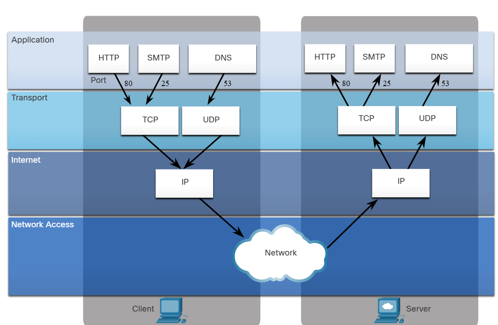
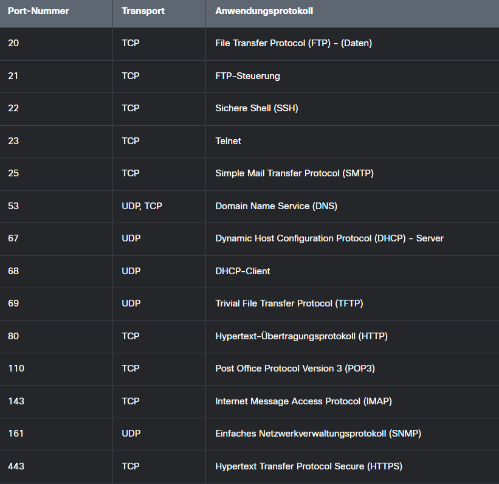

Gezeigt wird auch der netstat befehl der aktive netzwerkverbindungen und offene Ports anzeigt.<br>
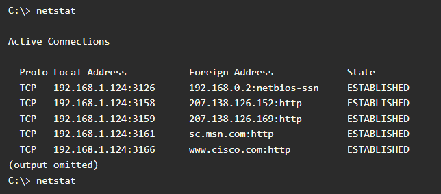

Die abschlussprüfung habe ich sehr gut bestanden.<br>


### Modul 16
Dienste der Anwendungsschicht ist das nächste und zweitletzte thema.<br>
Es soll die Funktion gängiger services der anwendungsschicht erläutern.<br>
Behandelt wurde:<br>
**Die Beziehung von Clients und Servern**<br>
Es wurde das Client-Server-Modell erklärt, inklusive der Rolle von Servern, Clients sowie der verwendeten Standards und Protokolle.<br>
Zudem wurden gängige Serverdienste wie Web-, E-Mail- und Dateiserver und die zugehörige Client-Software behandelt.<br>
Es wurde auch eine kleine demonstration in Packettracer gezeigt<br>
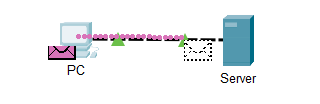<br>
**Anwendungsdienste im Netzwerk**<br>
Es wurden gängige Internet-Services und deren TCP/IP-basierte Bereitstellung erklärt.
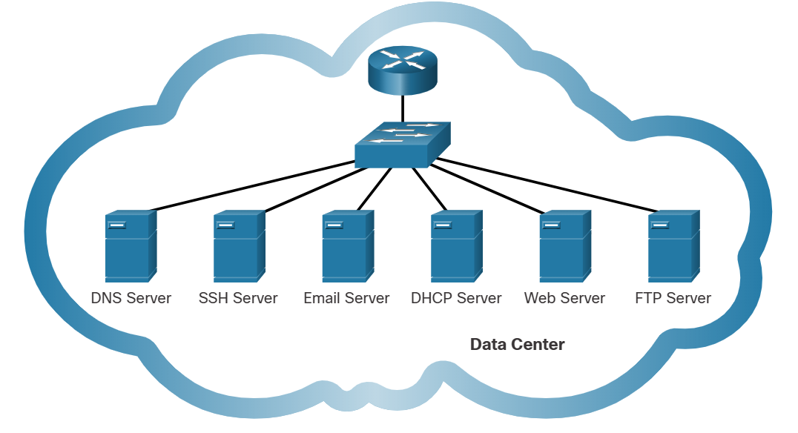<br>
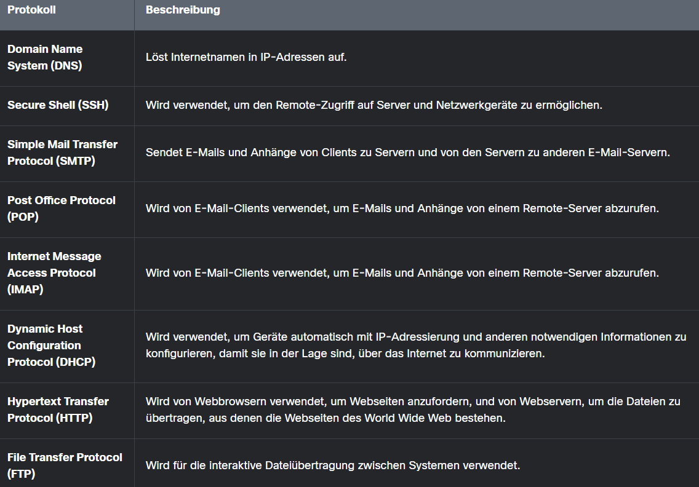<br>

**Domain Name System (DNS)**<br>
-Es wurde erklärt, wie ein DNS-Server Domainnamen in IP-Adressen auflöst, damit Clients Server im Internet erreichen können.<br>
Dabei wurde der Ablauf einer DNS-Anfrage und -Antwort zwischen Client und DNS-Server beschrieben.<br>
-Es wurde auch einen syntax-checker vorgestellt.<br>
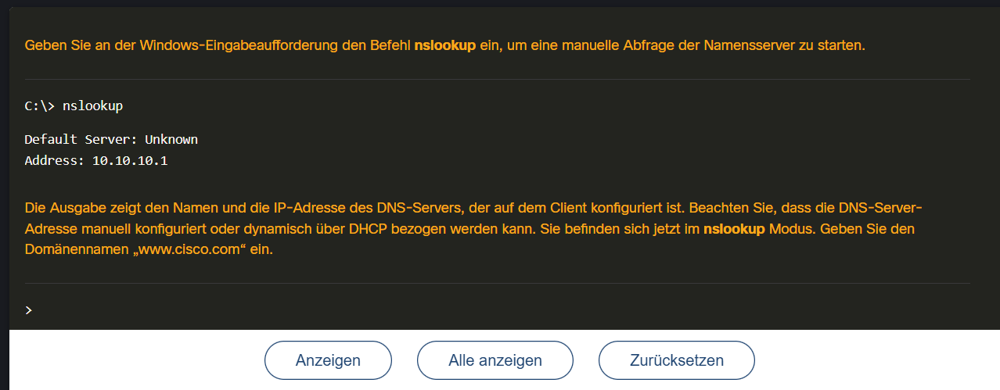
**Web-Clients und -Server**<br>
-Es wurden HTTP und HTML erklärt sowie deren Rolle bei der Kommunikation zwischen Client und Webserver.<br>
-Zusätzlich wurde gezeigt, wie über DNS die IP-Adresse ermittelt, die Webseite per HTTP angefordert und der HTML-Code im Browser dargestellt wird.

**FTP-Clients und -Server**<**br>
Es wurde erklärt, wie FTP zur Dateiübertragung zwischen Client und Server genutzt wird und welche Aufgaben dabei möglich sind (Upload, Download, Dateiverwaltung).<br>
Dabei wurde auch beschrieben, dass FTP eine Steuerverbindung (Port 21) und eine Datenverbindung (Port 20) verwendet.<br>
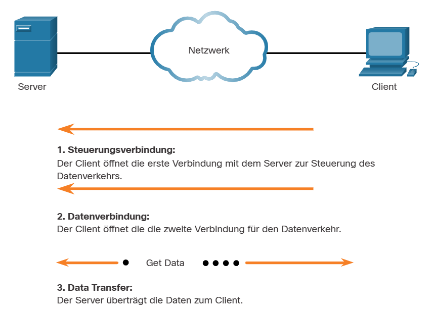
**Virtuelle Terminals**<br>
Es wurde erklärt, wie Telnet und SSH den Remote-Zugriff auf Server ermöglichen und wie dabei virtuelle Terminalsitzungen genutzt werden.<br>
Zusätzlich wurde gezeigt, dass Telnet Daten unverschlüsselt überträgt, während SSH eine sichere, verschlüsselte Verbindung mit Authentifizierung bereitstellt.<br>
Bilder zu Telnet:<br>
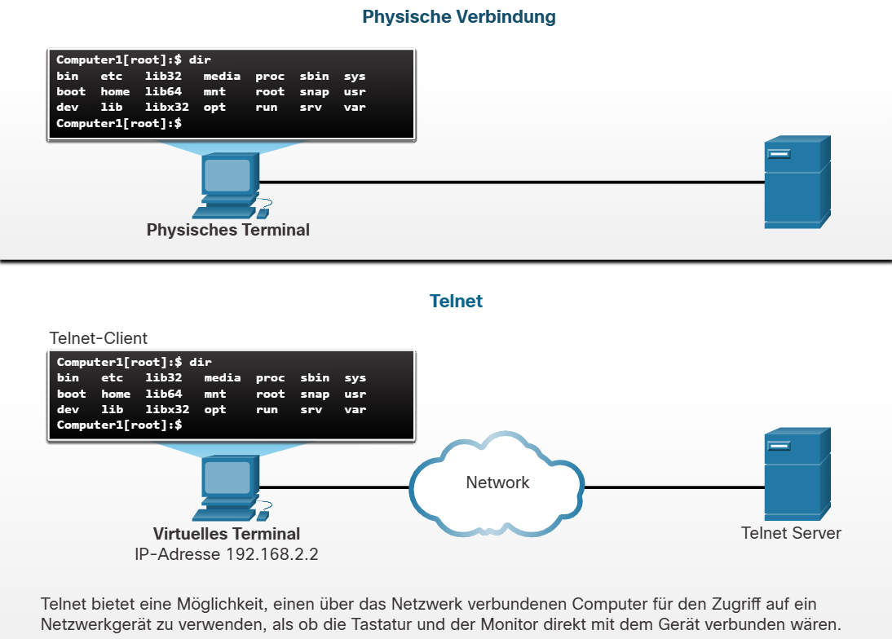<br>
Probleme von Telnet:<br>
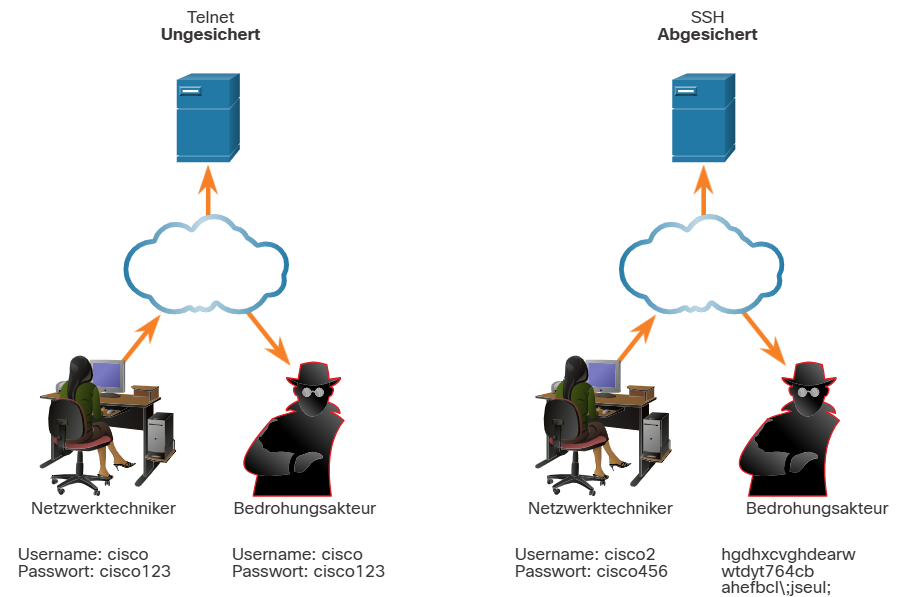
**E-Mail und Messaging**<br>
Es wurde erklärt, wie E-Mail als Client-Server-Dienst funktioniert und wie Nachrichten auf Mailservern gespeichert und von Clients abgerufen werden.<br>
Dabei wurden die E-Mail-Protokolle SMTP (Senden), POP3 und IMAP4 (Empfangen) sowie deren grundlegende Unterschiede und Ports beschrieben.<br>
**Abschlussprüfung:**<br>
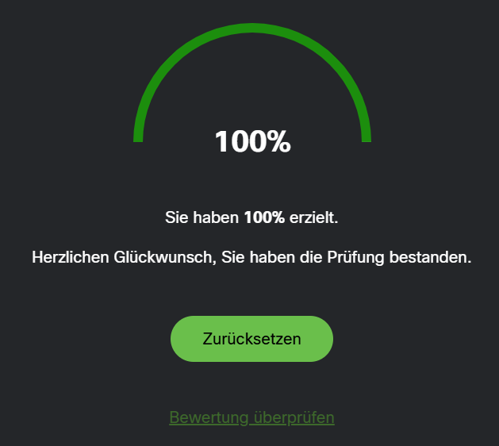
### Modul 17
Im letzten Modul dieses Kurses werden werkzeuge für Netzwerktests vorgestellt.
Ein überblick über die besprochenen Befehle.
- **ipconfig** - Zeigt IP-Konfigurationsinformationen an.
```
Windows IP Configuration
 
 
Ethernet adapter Ethernet:
 
   Media State . . . . . . . . . . . : Media disconnected
   Connection-specific DNS Suffix . :
 
Wireless LAN adapter Wi-Fi:
 
   Connection-specific DNS Suffix . : lan
   Link-local IPv6 Address . . . . . : fe80::a1cc:4239:d3ab:2675%6
   IPv4 Address. . . . . . . . . . . : 10.10.10.130
   Subnet Mask . . . . . . . . . . . : 255.255.255.0
   Default Gateway . . . . . . . . . : 10.10.10.1
```
Optionen Sind:<br>
/all --> zeigt zusätzliche informationen an.<br>
/release --> gibt die aktuellen DHCP-Bindungen frei<br>
/renew --> fordert neue Konfigurationsinformationen vom DHCP-Server an<br>
- **ping** - Testet Verbindungen zu anderen IP-Hosts.
```
C:\> ping 10.10.10.1
 
Pinging 10.10.10.1 with 32 bytes of data:
Reply from 10.10.10.1: bytes=32 time=1ms TTL=64
Reply from 10.10.10.1: bytes=32 time=1ms TTL=64
Reply from 10.10.10.1: bytes=32 time=1ms TTL=64
Reply from 10.10.10.1: bytes=32 time=1ms TTL=64
 
Ping statistics for 10.10.10.1:
    Packets: Sent = 4, Received = 4, Lost = 0 (0% loss),
Approximate round trip times in milli-seconds:
    Minimum = 1ms, Maximum = 1ms, Average = 1ms
 
C:\> ping www.cisco.com
 
Pinging e2867.dsca.akamaiedge.net [104.112.72.241] with 32 bytes of data:
Reply from 104.112.72.241: bytes=32 time=25ms TTL=53
Reply from 104.112.72.241: bytes=32 time=25ms TTL=53
Reply from 104.112.72.241: bytes=32 time=27ms TTL=53
Reply from 104.112.72.241: bytes=32 time=24ms TTL=53
 
Ping statistics for 104.112.72.241:
    Packets: Sent = 4, Received = 4, Lost = 0 (0% loss),
Approximate round trip times in milli-seconds:
    Minimum = 24ms, Maximum = 27ms, Average = 25ms
```
Optionen:
```
 -t             Ping the specified host until stopped.
                   To see statistics and continue - type Control-Break;
                   To stop - type Control-C.
    -a             Resolve addresses to hostnames.
    -n count       Number of echo requests to send.
    -l size        Send buffer size.
    -f             Set Don't Fragment flag in packet (IPv4-only).
    -i TTL         Time To Live.
    -v TOS         Type Of Service (IPv4-only. This setting has been deprecated
                   and has no effect on the type of service field in the IP
                   Header).
    -r count       Record route for count hops (IPv4-only).
    -s count       Timestamp for count hops (IPv4-only).
    -j host-list   Loose source route along host-list (IPv4-only).
    -k host-list   Strict source route along host-list (IPv4-only).
    -w timeout     Timeout in milliseconds to wait for each reply.
    -R             Use routing header to test reverse route also (IPv6-only).
                   Per RFC 5095 the use of this routing header has been
                   deprecated. Some systems may drop echo requests if
                   deprecated. Some systems may drop echo requests if
    -S srcaddr     Source address to use.
    -c compartment Routing compartment identifier.
    -p             Ping a Hyper-V Network Virtualization provider address.
    -4             Force using IPv4.
    -6             Force using IPv6.
```
- **netstat** - Zeigt Netzwerkverbindungen an.
```
C:\Users\cleue>netstat

Aktive Verbindungen

  Proto  Lokale Adresse         Remoteadresse          Status
  TCP    127.0.0.1:10107        cleue01nb24:61006      WARTEND
  TCP    127.0.0.1:14107        cleue01nb24:61003      HERGESTELLT
  TCP    127.0.0.1:14108        cleue01nb24:61002      SCHLIESSEN_WARTEN
  TCP    127.0.0.1:14109        cleue01nb24:61004      SCHLIESSEN_WARTEN
  TCP    127.0.0.1:14109        cleue01nb24:61005      SCHLIESSEN_WARTEN
  TCP    127.0.0.1:49695        cleue01nb24:53893      HERGESTELLT
  TCP    127.0.0.1:49695        cleue01nb24:53895      HERGESTELLT
  TCP    127.0.0.1:49695        cleue01nb24:53896      HERGESTELLT
```
- **tracert** - Zeigt die Route zum Ziel an.
```
C:\Users\cleue>tracert 8.8.8.8

Routenverfolgung zu dns.google [8.8.8.8]
über maximal 30 Hops:

  1     3 ms     2 ms     1 ms  internetbox.home [192.168.1.1]
  2     5 ms     7 ms     4 ms  1.88.60.188.dynamic.cust.swisscom.net [188.60.88.1]
  3     *        *        *     Zeitüberschreitung der Anforderung.
  4     5 ms     5 ms     5 ms  i79zhb-015-ae30.bb.ip-plus.net [193.134.95.172]
```
- **nslookup** - Fragt direkt den Nameserver nach Informationen über eine Zieldomäne ab.
```
C:\Users\cleue>nslookup tbz.ch
Server:  internetbox.home
Address:  2a02:1210:1818:4d00:def5:1bff:fe9e:1fc0

Nicht autorisierende Antwort:
Name:    tbz.ch
Addresses:  2606:4700:20::ac43:4a4f
          2606:4700:20::681a:739
          2606:4700:20::681a:639
          104.26.6.57
          104.26.7.57
          172.67.74.79
```

**Abschluss**<br>
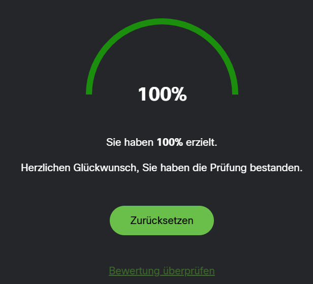

### Letzte kontrollprüfung
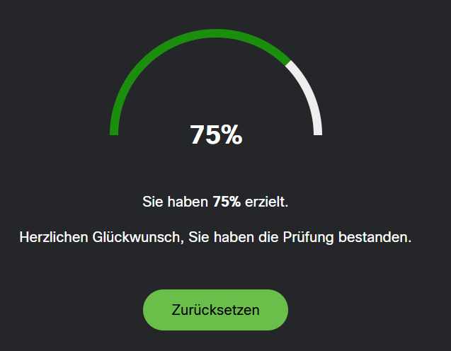

# Abschluss
Die allerletzte grosse Prüfung dieses Kurses.
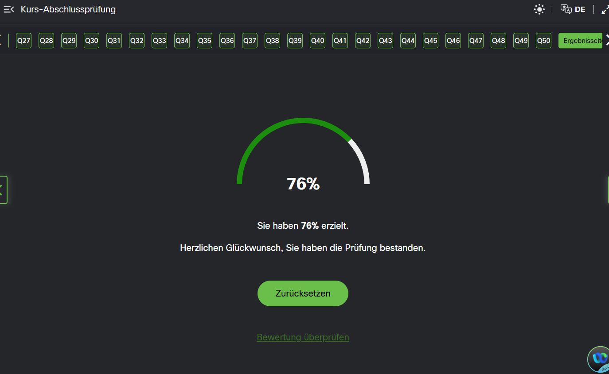
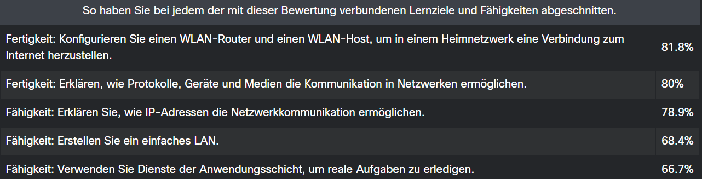
### Zertifikat
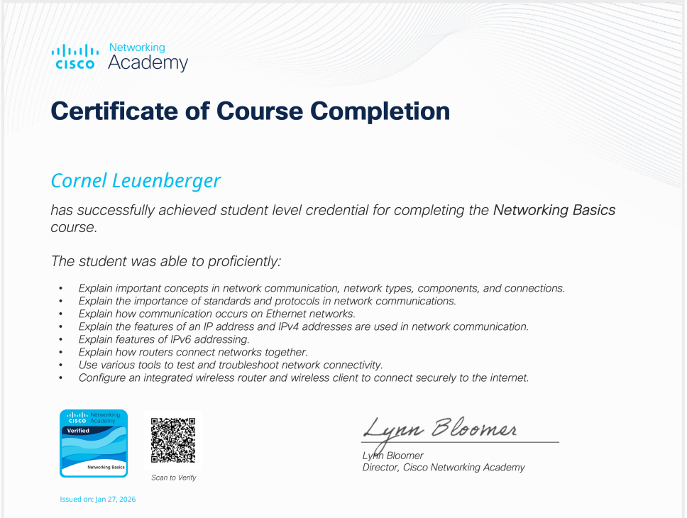